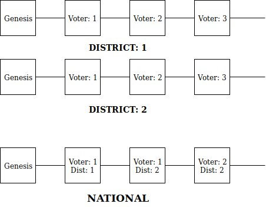
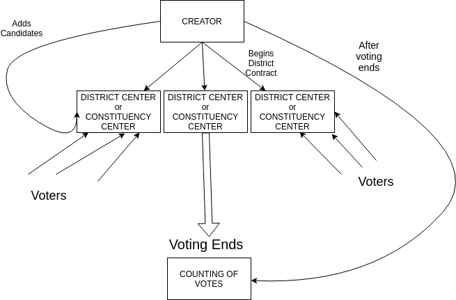

# CodeFunDo++ 2019
## Team Macrohard
Idea for CodeFunDo++ 2019
-------------------------------

### Blockchain Voting System

#### Current Systems 

* The current system uses Electronic Voting Machines (EVM).
* Voting in India takes place at constituency level, where the people vote for candidates of various constituencies to join the Legislative Assembly. 
* People have to register for availing a Voter ID when they turn 18. After that based on the location of the person a voter list is generated and circulated across the corresponding polling booths. 
* In some places this voting is done using paper ballots instead of EVMs.  


#### Issues with the current system

* The major issue is that the EVMs are very suseptible to external interventions. Many cases of EVM hacking / rigging of EVM machines have been reported.
* Many a times citizens are not able to vote because they cannot make it to their own constituency. 
* Cases of names missing from the voting list.
* Miscounting of votes due to the use of paper ballots. The task of counting and compiling is very time consuming . 
* Lack of complete awareness of the candidates.

### Our Solution 

#### What are we planning to build? 
 
* We plan to build a complete blockchain for voting that functions not only at the constitency level but also at the national level. 
* A voters list will not be created for each polling booth but one for the constituency as no voter will be assigned a particuar voting booth. 
* Rather voters would vote for candidates of their constituencies without requiring to be present in a voting booth set up in their constituency. 
* The blockchain will be accompanied by a website that uses biometrics (as applicable) to authentication the voters and provide the voters with the voting page. 
* The website would also furnish details of the participating candidates so that the voters may assure themselves of their choice: 
    1. Criminal Record
    2. Funds Utilization
    3. Candidate's Agenda
* The website would show the candidates belonging to the constitency of the voter.
* Each voter after voting would receive a reference ID so that they can later see that their vote was accounted for. 
* The counting would be done automatically at both the constituency level as well as the national level to ensure that there is no miscounting.

#### How are we planning to build it?

* We plan to build an *Ethereum* based **private** blockchain that would be set up at all the voting booths across India. 
* The entire blockchain would use the technology provided by **Azure Blockchain Services** so as to ensure easy integration. 
* There would be 2 blockchains running simultaneously: 
  * One at a constituency level
  * Other at a national level. 
  

  
* There would be different _permission levels_ for this private blockchain:
  * Creator
  * District centres
  * Voters
  
* There would be a __smart contract__ for the creation of the election that the creator would be able to trigger. 
* After the creation of the voting blockchain, all the candidates and the district centers would be loaded onto the blockchain through the use of another smart contract. 
* The district centers would have their own smart contracts that would enable the voters to vote.
* After the expiry of the district smart contracts, another smart contract for counting the votes would begin that would compile the scores of each of the voters.

* Each voter would be provided with an _Ethereum_ account and value **1**. Each vote requires a value **1** so that each voter may vote only once.
* This would take place with the integration of solidity, javascript and metamask to exploit the Web3 framework to ensure smoothness of the procedure.

* The website would display the details of the candidates stored in one of the earler blocks of the blockchain established by the _Creator_ of the voting procedure. 
 * The website would use the details of the voter to find out the constituency of the voter.
 * It would then search the blockchain for the details of the candidates in the corresponding constituency. 
 * After that it would display them using JavaScript and HTML.
 
* To ensure the privacy of the voters we will use the _Shamir's Secret Service Scheme_ 

* For those voters who have special permissions to vote remotely (i.e not visit a particular polling/voting booth), we would create a face recognition system using a Neural Network similar to DeepFace that would identify the person. 



#### What technologies that we are using? 

* We will be using **Azure Blockchain Services** - Ethereum to create the blockchain.
* We will be using **JavaScript, Solidity and Metamask** to deploy the _smart contracts_ on the blockchain.
* We will be using **HTML/CSS** to create the website.
* We will be using **VGG - 19 or VGG - 16** Neural Network to develop the Face Recognition API. This will be integrated by using **Python**


## Additions for Submission

### Solidity Smart Contract Code

```solidity

pragma solidity ^0.5.8;
pragma experimental ABIEncoderV2;


contract ElectionCreation {
    Ballot[] public deployedBallot;
    constructor (bytes32[] memory candidates, uint[] memory district, bytes32[] memory education, bytes32[] memory criminal_record,  uint hour, uint8[] memory age, uint[] memory net_worth) public  {
        for(uint i = 0; i < district.length; i++){
            Ballot newBallot = new Ballot(candidates, district[i], education, criminal_record, msg.sender, hour, age, net_worth);
            deployedBallot.push(newBallot);
        }
    }
    function getDeployedBallots() public view returns(Ballot[] memory){
        return deployedBallot;
    }
}


contract Ballot{
    struct Candidate {
        uint64 voteCount;
        bytes32 name;
        uint district;
        uint8 age;
        bytes32 criminalRecord;
        bytes32 education;
        uint netWorth;
        uint creationTime;
        uint ExpirationDate;
    }
    
    Candidate[] public candidates;
    address public manager;
    uint votingDistrict;
    mapping(address => bool) public voters;
    
    modifier restricted (){
        require(msg.sender == manager);
        _;
    }
    
    constructor (bytes32[] memory candidates_names, uint district, bytes32[] memory education, bytes32[] memory criminal_record, address creator, uint hour, uint8[] memory age, uint[] memory net_worth) public {
        manager = creator;
        votingDistrict = district;
        for (uint i = 0; i < candidates_names.length; i++){
            candidates.push(Candidate({
                name : candidates_names[i],
                voteCount : 0,
                district : district,
                age : age[i],
                criminalRecord : criminal_record[i],
                education : education[i],
                netWorth : net_worth[i],
                creationTime : now,
                ExpirationDate : now + hour
            }));
            
        }
    }
    
    struct Vote{
        address voteAddress;
        uint transID;
        string passwordHash;
        uint votedTo;
    }
    
    Vote[] votes;
    
    uint gl_transID = 0;
    
    function vote(uint candidate, string memory _passwordHash) public returns(Vote memory) {
        require(!voters[msg.sender]);
        if(now > candidates[candidate].ExpirationDate){
            revert();
        }
        else {
            candidates[candidate].voteCount += 1;
            voters[msg.sender] = true;
            Vote memory newVote = Vote({
                voteAddress : msg.sender,
                transID : gl_transID + 1,
                passwordHash : _passwordHash, 
                votedTo : candidate
            });
            votes.push(newVote);
            gl_transID +=1;
            return newVote;
        }
    }
    
    
    function show_vote(uint _transID, string memory _passwordHash) public view returns(uint, uint, address){
        for(uint i = 0; i < votes.length; i++){
            if(votes[i].transID == _transID && keccak256(abi.encodePacked(votes[i].passwordHash)) == keccak256(abi.encodePacked(_passwordHash))){
                return(votes[i].transID, votes[i].votedTo, votes[i].voteAddress);
            }
        }
        // Add a case for not finding the element
    }

    function show_name() public view returns(bytes32){
        return candidates[0].name;
    }
    
    
   // function show_candidates(uint _district) public view returns(Candidate[100] memory){
   //      Candidate[100] memory required_candidates;
   //      for(uint i = 0; i<candidates.length; i++){
   //          if(candidates[i].district == _district){
   //              required_candidates[i] = candidates[i];
   //           }
   //      }
    //     return(required_candidates);
    // }

    function show_candidates() public view returns(Candidate[] memory){
        return candidates;
    }
    
    function getVoteCount(uint index) public view returns(uint) {
        require(now > candidates[index].ExpirationDate);
        return candidates[index].voteCount;
    } 
}

```

### Solutions for Remote Voting
We would provide a solution for remote voting for those with special permission. After the voter votes, a confirmation mail would come to him some day in the same week or the entire duration of the national voting. The person would be required to have the same vote as previous one for this as well. If it is a different one, then the vote would be nullified.

### How would 2 chains solve the issue? 
The National chain would have more blocks and more validators. This would reduce the probabiltity of a untrusted validator, and his/her influence in the system would be 0. But at the same time, maintaining a national chain is an enormous task and that's why we would have a local level one so as to ensure that each block is added to the chain and also so that the counting process becomes faster.


### Project Directory
Here is the zip file of the project directory. <br>
Link: https://1drv.ms/u/s!Am8mfksK8R_6g0ujDb4IXJdf57aI?e=eBWUqh

### Screenshots


### NodeJS Code for Website Creation

``` JavaScript
var ethereumjs = require('ethereumjs-tx').Transaction;
var wallet = require('ethereumjs-wallet');
var Web3 = require('web3');
var fs = require('fs');

var elec_address = "0x0a3Eb2E4a6e950c8499B3a29D35E017E426B8C7b";
var elec_abi = JSON.parse(fs.readFileSync("./build/contracts/ElectionCreation.json"));

var ballot_address = "0xa859E3f4C2e8b6ED7f5Bb8Cc06ae9A2AF38D92B5";
var ballot_abi = JSON.parse(fs.readFileSync("./build/contracts/Ballot.json"));


//Generate new Ethereum Account
var account = wallet.generate();
var accountAddress = account.getAddressString();
//var accountAddress = "0x528F3C7C706914e32E66E7f6D4Fd1e691F8F18E6";
var privateKey = account.getPrivateKey();
//var privateKey = new Buffer("04a5f968d0037d31a8c1aa1a03ba01c2602f5d8ffac6c38837b303075d33b6f7", "hex");

//TODO: Replace with the correct RPC
var web3 = new Web3();
web3.setProvider(new web3.providers.HttpProvider("http://127.0.0.1:8545"));


//Get Nonce for the account
web3.eth.getTransactionCount(accountAddress, function(err, nonce){

    var elec_func = new web3.eth.Contract(elec_abi.abi,elec_address);
    

    data = new web3.eth.Contract(ballot_abi.abi,ballot_address).methods.show_name().encodeABI();
    //    console.log(data);
    rawTx = {
      nonce: nonce,
      gasPrice: '0x0000000000000000000000000',
      gasLimit: web3.utils.numberToHex(6721975),
      to: ballot_address,
      value: '0x00',
      data: data
    }
     tx = new ethereumjs(rawTx);
     tx.sign(privateKey);
     raw = '0x' + tx.serialize().toString('hex');
    // web3.eth.sendSignedTransaction(raw).on('receipt', console.log);

    var func_bal = new web3.eth.Contract(ballot_abi.abi, ballot_address);
    func_bal.methods.show_candidates().call();//then(console.log);
});


const express = require('express');
const bodyParser = require('body-parser');
const app = express();

app.set('view engine', 'ejs');
app.use(bodyParser.urlencoded({extended: true}));

app.get('/', function(req,res){
    res.render('index');
})

//app.get('/', function(req, res){
//    
//})

app.post('/', function(req, res){
    var district = req.body.district;
    console.log(req.body.district);
    res.redirect('/vote?dno=' + district);
})

app.get('/vote', function(req, res){
    var district = req.query.dno;
    var func_bal = new web3.eth.Contract(ballot_abi.abi, ballot_address);
    func_bal.methods.show_candidates().call().then((response) =>{
        console.log(response[0])
        res.render('vote',{response: response, dno:district});
    });
})

app.post('/vote', function(req, res){
    var name = req.body.name;
    var pwd = req.body.passwd;
    res.redirect('/finished?name=' + name + '&passwd=' + pwd);
})

app.get('/finished', function(req,res){
    var name = req.query.name;
    var passwd = req.query.passwd;
    var func_bal = new web3.eth.Contract(ballot_abi.abi, ballot_address);
    func_bal.methods.vote([name],passwd).call().then((response) =>{
        res.render('finished',{response: response});
    });
})

app.get('/check', function(req, res) {
    var lid = req.body.lid;
    var func_bal = new web3.eth.Contract(ballot_abi.abi, ballot_address)
})

app.listen(3000, function(){
    console.log('Example App on 3000');
})


```.
```


  
